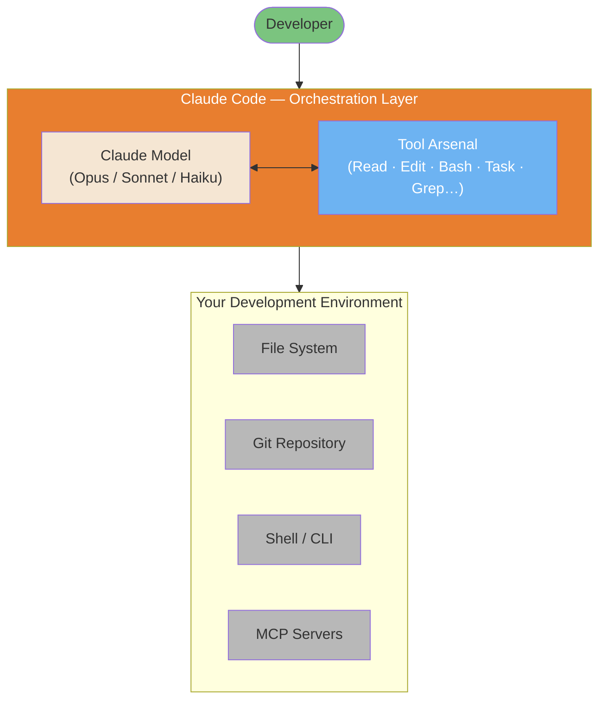

# How Claude Code Works: Architecture & Internals

> A technical deep-dive into Claude Code's internal mechanisms, based on official Anthropic documentation and verified community analysis.

**Author**: Florian BRUNIAUX | Contributions from Claude (Anthropic)

**Reading time**: ~25 minutes (full) | ~5 minutes (TL;DR only)

**Last verified**: February 2026 (Claude Code v2.1.34)

---

## Source Transparency

This document combines three tiers of sources:

| Tier | Description | Confidence | Example |
|------|-------------|------------|---------|
| **Tier 1** | Official Anthropic documentation | 100% | anthropic.com/engineering/* |
| **Tier 2** | Verified reverse-engineering | 70-90% | PromptLayer analysis, code.claude.com behavior |
| **Tier 3** | Community inference | 40-70% | Observed but not officially confirmed |

Each claim is marked with its confidence level. **Always prefer official documentation** when available.

---

## TL;DR - 5 Bullet Summary

1. **Simple Loop**: Claude Code runs a `while(tool_call)` loop — no DAGs, no classifiers, no RAG. The model decides everything.

2. **Eight Core Tools**: Bash (universal adapter), Read, Edit, Write, Grep, Glob, Task (sub-agents), TodoWrite. That's the entire arsenal.

   **Search Strategy Evolution**: Early Claude Code versions experimented with RAG using Voyage embeddings for semantic code search. Anthropic switched to grep-based (ripgrep) agentic search after internal benchmarks showed superior performance with lower operational complexity — no index sync required, no security liabilities from external embedding providers. This "Search, Don't Index" philosophy trades latency/tokens for simplicity/security. Community plugins (ast-grep for AST patterns) and MCP servers (Serena for symbols, grepai for RAG) available for specialized needs.

   *Source*: [Latent Space podcast](https://www.latent.space/p/claude-code) (May 2025), ast-grep documentation

3. **200K Token Budget**: Context window shared between system prompt, history, tool results, and response buffer. Auto-compacts at ~75-92% capacity.

4. **Sub-agents = Isolation**: The `Task` tool spawns sub-agents with their own context. They cannot spawn more sub-agents (depth=1). Only their summary returns.

5. **Philosophy**: "Less scaffolding, more model" — trust Claude's reasoning instead of building complex orchestration systems around it.

---

## Visual Overview

Claude Code is not a new AI model. It's an orchestration layer that wraps Claude (Opus/Sonnet/Haiku) with the ability to read files, run shell commands, navigate repositories, and spawn sub-agents — all in a continuous loop until the task is done.



*Inspired by [Mohamed Ali Ben Salem's architecture diagram](https://www.linkedin.com/posts/mohamed-ali-ben-salem-2b777b9a_en-ce-moment-je-vois-passer-des-posts-du-activity-7420592149110362112-eY5a) — See [Architecture Internals diagrams](../diagrams/04-architecture-internals.md) for a deeper breakdown.*

---

## Table of Contents

- [Visual Overview](#visual-overview)

1. [The Master Loop](#1-the-master-loop)
2. [The Tool Arsenal](#2-the-tool-arsenal)
3. [Context Management Internals](#3-context-management-internals)
4. [Sub-Agent Architecture](#4-sub-agent-architecture)
5. [Permission & Security Model](#5-permission--security-model)
6. [MCP Integration](#6-mcp-integration)
7. [Advanced Tool Use Patterns (API)](#7-advanced-tool-use-patterns-api)
8. [The Edit Tool: How It Actually Works](#8-the-edit-tool-how-it-actually-works)
9. [Session Persistence](#9-session-persistence)
10. [Philosophy: Less Scaffolding, More Model](#10-philosophy-less-scaffolding-more-model)
11. [Claude Code vs Alternatives](#11-claude-code-vs-alternatives)
12. [Sources & References](#12-sources--references)
13. [Appendix: What We Don't Know](#13-appendix-what-we-dont-know)


---

## 1. The Master Loop

**Confidence**: 100% (Tier 1 - Official)
**Source**: [Anthropic Engineering Blog](https://www.anthropic.com/engineering/claude-code-best-practices)

At its core, Claude Code is remarkably simple:

```
┌─────────────────────────────────────────────────────────────┐
│                    CLAUDE CODE MASTER LOOP                  │
├─────────────────────────────────────────────────────────────┤
│                                                             │
│   ┌──────────────┐                                          │
│   │  Your Prompt │                                          │
│   └──────┬───────┘                                          │
│          │                                                  │
│          ▼                                                  │
│   ┌──────────────────────────────────────────────────────┐  │
│   │                                                      │  │
│   │                  CLAUDE REASONS                      │  │
│   │        (No classifier, no routing layer)             │  │
│   │                                                      │  │
│   └────────────────────────┬─────────────────────────────┘  │
│                            │                                │
│                            ▼                                │
│                   ┌────────────────┐                        │
│                   │  Tool Call?    │                        │
│                   └───────┬────────┘                        │
│                           │                                 │
│              YES          │           NO                    │
│         ┌─────────────────┴─────────────────┐               │
│         │                                   │               │
│         ▼                                   ▼               │
│  ┌────────────┐                      ┌────────────┐         │
│  │  Execute   │                      │   Text     │         │
│  │   Tool     │                      │  Response  │         │
│  │            │                      │   (DONE)   │         │
│  └─────┬──────┘                      └────────────┘         │
│        │                                                    │
│        ▼                                                    │
│  ┌─────────────┐                                            │
│  │ Feed Result │                                            │
│  │  to Claude  │──────────────────┐                         │
│  └─────────────┘                  │                         │
│                                   │                         │
│                                   ▼                         │
│                          ┌────────────────┐                 │
│                          │   LOOP BACK    │                 │
│                          │  (Next turn)   │                 │
│                          └────────────────┘                 │
│                                                             │
└─────────────────────────────────────────────────────────────┘
```

### What This Means

The entire architecture is a simple `while` loop:

```
while (claude_response.has_tool_call):
    result = execute_tool(tool_call)
    claude_response = send_to_claude(result)
return claude_response.text
```

**There is no:**
- Intent classifier
- Task router
- RAG/embedding pipeline
- DAG orchestrator
- Planner/executor split

The model itself decides when to call tools, which tools to call, and when it's done. This is the "agentic loop" pattern described in Anthropic's engineering blog.

### Why This Design?

1. **Simplicity**: Fewer components = fewer failure modes
2. **Model-driven**: Claude's reasoning is better than hand-coded heuristics
3. **Flexibility**: No rigid pipeline constraining what Claude can do
4. **Debuggability**: Easy to understand what happened and why

### Agentic Loop API Vocabulary

The master loop diagram above shows the flow conceptually, but the Anthropic API exposes it through concrete `stop_reason` values. Every API response includes a `stop_reason` field — it's how Claude signals what should happen next. Understanding these three values is essential for building custom agents on top of the Anthropic SDK.

| `stop_reason` | Meaning | Loop action |
|---------------|---------|-------------|
| `tool_use` | Claude wants to call one or more tools | Execute tools, feed results back, continue loop |
| `end_turn` | Claude decided it has finished | Exit loop, return the text response |
| `max_tokens` | Context limit reached before finishing | Rethink context strategy, likely need summarization |

The pseudocode becomes precise with these names:

```python
messages = [{"role": "user", "content": user_prompt}]

while True:
    response = client.messages.create(model=model, messages=messages, tools=tools)

    if response.stop_reason == "end_turn":
        return response.content[0].text  # done

    if response.stop_reason == "tool_use":
        # Process every tool_use block in the response
        tool_results = []
        for block in response.content:
            if block.type == "tool_use":
                result = execute_tool(block.name, block.input)
                tool_results.append({
                    "type": "tool_result",
                    "tool_use_id": block.id,
                    "content": result
                })
        messages.append({"role": "assistant", "content": response.content})
        messages.append({"role": "user", "content": tool_results})
        # loop continues
```

The `tool_use` block inside `response.content` has three fields you act on: `id` (to match results back), `name` (which function to call), and `input` (a dict of arguments). The result you send back must reference `tool_use_id` so the model can correlate call and response.

**`fork_session`** is a higher-level concept built on this loop: it creates an independent branch of the current conversation, sharing the same message history up to the fork point. Both branches can explore different approaches or configurations simultaneously, like `git branch` but for agent sessions. Each fork runs its own agentic loop independently — useful for comparing responses under different tool configurations or prompt variants without re-running the full conversation from scratch.

#### Controlling loop depth with max_turns

`max_turns` caps the number of assistant/tool iterations before the orchestrator exits. Without an explicit limit, a runaway loop can exhaust budget or context window in ways that are hard to diagnose after the fact.

Practical ranges by task type:

| Task type | Recommended `max_turns` |
|---|---|
| Simple retrieval (single lookup) | 5 |
| Research or multi-step coding | 20-30 |
| Extended autonomous workflows | 50 |

When `max_turns` is reached, the loop exits with whatever state was last written. The task may be incomplete. Always check the final `stop_reason` and implement a fallback path:

```python
result = agent.run(task, max_turns=20)
if result.stop_reason == "max_turns":
    # escalate or summarize partial progress
    handle_incomplete(result)
```

Setting `max_turns` per task type rather than globally prevents a single slow task from starving others in a multi-agent pipeline. A nightly batch job that legitimately needs 50 turns should not inherit the same cap as a quick lookup that should resolve in 5.

### Native Capabilities Audit

Use this checklist to verify you understand Claude Code's full surface area. Each capability is documented in detail elsewhere in this guide.

**The 11 Native Capabilities**:

- [ ] **Event Hooks** — Bash/PowerShell scripts triggered on tool execution
  - PreToolUse, PostToolUse, UserPromptSubmit, Notification
  - See: [Section 5 Hooks](#5-permission--security-model)

- [ ] **Skill-Scoped Hooks** — Event hooks specific to skill execution context
  - Lifecycle management per skill
  - See: [Ultimate Guide Section 5.11](#51-understanding-skills)

- [ ] **Background Agents** — Async task execution (test suites, long operations)
  - Non-blocking agent spawning
  - See: [Section 4.2 Sub-Agent Architecture](#4-sub-agent-architecture)

- [ ] **Explore Subagent** — `/explore` for codebase analysis
  - Read-only codebase exploration
  - See: [Section 4.2 Sub-Agents](#4-sub-agent-architecture)

- [ ] **Plan Subagent** — `/plan` for read-only planning mode
  - Safe architectural exploration
  - See: [Ultimate Guide Section 2.3](#23-plan-mode)

- [ ] **Task Tool** — Hierarchical task delegation to specialized agents
  - Parallel task execution, depth=1 sub-agents
  - See: [Section 4.2 Sub-Agent Architecture](#4-sub-agent-architecture)

- [ ] **Agent Teams** — Multi-agent parallel coordination (experimental v2.1.32+)
  - Git-based coordination, autonomous task claiming
  - See: [Ultimate Guide Section 9.20](#920-agent-teams-multi-agent-coordination)

- [ ] **Per-Task Model Selection** — Dynamic model switching mid-session
  - `/model opus|sonnet|haiku` on task boundaries
  - See: [Section 10 Cost Optimization](#10-claude-code-vs-alternatives)

- [ ] **MCP Protocol Integration** — Model Context Protocol for tool extensions
  - Context7, Sequential, Serena, Playwright, etc.
  - See: [Section 6 MCP Integration](#6-mcp-integration)

- [ ] **Permission Modes** — Fine-grained control over tool execution
  - Default, auto-accept, plan mode, custom rules
  - See: [Section 5 Permission & Security Model](#5-permission--security-model)

- [ ] **Session Memory** — Persistent context across sessions
  - CLAUDE.md, memory files, project state
  - See: [Section 8 Session Persistence](#8-session-persistence)

**Onboarding Tip**: If you haven't explored all 11 capabilities, you're likely missing productivity opportunities. Focus on the unchecked items above.

**Source**: Synthesized from [Gur Sannikov analysis](https://www.linkedin.com/posts/gursannikov_claudecode-embeddedengineering-aiagents-activity-7423851983331328001-DrFb)

---

## 2. The Tool Arsenal

**Confidence**: 100% (Tier 1 - Official)
**Source**: [code.claude.com/docs](https://code.claude.com/docs/en/setup)

Claude Code has exactly 8 core tools:

| Tool | Purpose | Key Behavior | Token Cost |
|------|---------|--------------|------------|
| `Bash` | Execute shell commands | Universal adapter, most powerful | Low (command) + Variable (output) |
| `Read` | Read file contents | Max 2000 lines, handles truncation | High for large files |
| `Edit` | Modify existing files | Diff-based, requires exact match | Medium |
| `Write` | Create/overwrite files | Must read first if file exists | Medium |
| `Grep` | Search file contents | Ripgrep-based (regex), replaced RAG/embedding approach. For structural code search (AST-based), see ast-grep plugin. Trade-off: Grep (fast, simple) vs ast-grep (precise, setup required) vs Serena MCP (semantic, symbol-aware) | Low |
| `Glob` | Find files by pattern | Path matching, sorted by mtime | Low |
| `Task` | Spawn sub-agents | Isolated context, depth=1 limit | High (new context) |
| `TodoWrite` | Track progress | Structured task management | Low |

### The Bash Universal Adapter

**Key insight**: Bash is Claude's swiss-army knife. It can:

- Run any CLI tool (git, npm, docker, curl...)
- Execute scripts
- Chain commands with pipes
- Access system state

The model has been trained on massive amounts of shell data, making it highly effective at using Bash as a universal adapter when specialized tools aren't enough.

### Tool Selection Logic

Claude decides which tool to use based on the task. There's no hardcoded routing:

```
┌─────────────────────────────────────────────────────┐
│              TOOL SELECTION (Model-Driven)          │
├─────────────────────────────────────────────────────┤
│                                                     │
│  "Read auth.ts"           → Read tool               │
│  "Find all test files"    → Glob tool               │
│  "Search for TODO"        → Grep tool               │
│  "Run npm test"           → Bash tool               │
│  "Explore the codebase"   → Task tool (sub-agent)   │
│  "Track my progress"      → TodoWrite tool          │
│                                                     │
│  The model learns these patterns during training,   │
│  not from explicit rules.                           │
│                                                     │
└─────────────────────────────────────────────────────┘
```

### Extended Tool Ecosystem

Beyond the 8 core tools, Claude Code can leverage:

**MCP Servers** (Model Context Protocol):
- **Serena**: Symbol-aware code navigation + session memory
- **grepai**: Semantic search + call graph analysis (Ollama-based)
- **Context7**: Official library documentation lookup
- **Sequential**: Structured multi-step reasoning
- **Playwright**: Browser automation and E2E testing
- **claude-code-ultimate-guide**: 12 tools — guide search, release tracking, `compare_versions`, security threat lookup (`get_threat`, `list_threats` with 28 CVEs + 655 malicious skills), template search (`search_examples`) — `npx -y claude-code-ultimate-guide-mcp`

**Community Plugins**:
- **ast-grep**: AST-based structural code search (explicit invocation)

### Search Tool Selection Matrix

Claude Code offers multiple ways to search code, each with specific strengths:

| Search Need | Native Tool | MCP/Plugin Alternative | When to Escalate |
|-------------|-------------|----------------------|------------------|
| Exact text | `Grep` (ripgrep) | - | Never (fastest) |
| Function name | `Grep` | Serena `find_symbol` | Multi-file refactoring |
| By meaning | - | grepai `search` | Don't know exact text |
| Call graph | - | grepai `trace_callers` | Dependency analysis |
| Structural pattern | - | ast-grep | Large migrations (>50k lines) |
| File structure | - | Serena `get_symbols_overview` | Need symbol context |

**Performance Comparison**:

| Tool | Speed | Setup | Use Case |
|------|-------|-------|----------|
| Grep (ripgrep) | ⚡ ~20ms | ✅ None | 90% of searches |
| Serena | ⚡ ~100ms | ⚠️ MCP | Refactoring, symbols |
| grepai | 🐢 ~500ms | ⚠️ Ollama + MCP | Semantic, call graph |
| ast-grep | 🕐 ~200ms | ⚠️ Plugin | AST patterns, migrations |

**Decision principle**: Start with Grep (fastest), escalate to specialized tools only when needed.

> **📖 Deep Dive**: See [Search Tools Mastery](../workflows/search-tools-mastery.md) for comprehensive workflows combining all search tools.

---

## 3. Context Management Internals

**Confidence**: 80% (Tier 2 - Partially Official)
**Sources**:
- [platform.claude.com/docs](https://platform.claude.com/docs/en/build-with-claude/context-windows) (Tier 1)
- Observed behavior (Tier 2)

Claude Code operates within a fixed context window (~200K tokens, varies by model).

### Context Budget Breakdown

```
┌─────────────────────────────────────────────────────────────┐
│                 CONTEXT BUDGET (~200K tokens)               │
├─────────────────────────────────────────────────────────────┤
│                                                             │
│  ┌──────────────────────────────────────────────────────┐   │
│  │ System Prompt                            (~5-15K)    │   │
│  │ • Tool definitions                                   │   │
│  │ • Safety instructions                                │   │
│  │ • Behavioral guidelines                              │   │
│  │ • See detailed breakdown below ↓                     │   │
│  ├──────────────────────────────────────────────────────┤   │
│  │ CLAUDE.md Files                          (~1-10K)    │   │
│  │ • Global ~/.claude/CLAUDE.md                         │   │
│  │ • Project /CLAUDE.md                                 │   │
│  │ • Local /.claude/CLAUDE.md                           │   │
│  ├──────────────────────────────────────────────────────┤   │
│  │ Conversation History                     (variable)  │   │
│  │ • Your prompts                                       │   │
│  │ • Claude's responses                                 │   │
│  │ • Tool call records                                  │   │
│  ├──────────────────────────────────────────────────────┤   │
│  │ Tool Results                             (variable)  │   │
│  │ • File contents from Read                            │   │
│  │ • Command outputs from Bash                          │   │
│  │ • Search results from Grep                           │   │
│  ├──────────────────────────────────────────────────────┤   │
│  │ Reserved for Response                    (~40-45K)   │   │
│  │ • Claude's thinking                                  │   │
│  │ • Generated code/text                                │   │
│  └──────────────────────────────────────────────────────┘   │
│                                                             │
│  USABLE = Total - System - Reserved ≈ 140-150K tokens       │
│                                                             │
└─────────────────────────────────────────────────────────────┘
```

### System Prompt Contents

**Confidence**: 100% (Tier 1 - Official Anthropic Documentation)
**Sources**:
- [Anthropic System Prompts Release Notes](https://platform.claude.com/docs/en/release-notes/system-prompts)
- [Anthropic Engineering: Claude Code Best Practices](https://www.anthropic.com/engineering/claude-code-best-practices)

Claude system prompts (~5-15K tokens) are **publicly published** by Anthropic as part of their transparency commitment. These prompts define:

**Core Components**:
- **Tool definitions**: Bash, Read, Edit, Write, Grep, Glob, Task, TodoWrite
- **Safety instructions**: Content policies, refusal patterns (see [Security Hardening](../security/security-hardening.md))
- **Behavioral guidelines**: Task-first approach, MVP-first, no over-engineering
- **Context instructions**: How to gather and use project context

**Important Distinctions**:
- **Claude.ai/Mobile**: Published prompts available publicly
- **Anthropic API**: Different default instructions, configurable by developers
- **Claude Code CLI**: Agentic coding assistant with context-gathering behavior

**Community Analysis** (for deeper understanding):
- **Simon Willison's Claude 4 Analysis** (May 2025): [Deep-dive into thinking blocks, search rules, safety guardrails](https://simonwillison.net/2025/May/25/claude-4-system-prompt/)
- **PromptHub Technical Breakdown** (June 2025): [Detailed analysis of prompt engineering patterns](https://www.prompthub.us/blog/an-analysis-of-the-claude-4-system-prompt)

→ **Cross-reference**: For security implications, see [Section 5: Permission & Security Model](#5-permission--security-model)

**Note**: Claude Code system prompts may differ from Claude.ai/mobile versions. The above sources cover the Claude family; Code-specific prompts are integrated into the CLI tool's behavior.

---

### Auto-Compaction

**Confidence**: 75% (Tier 2 - Community-verified with research backing)

When context usage exceeds a threshold, Claude Code automatically summarizes older conversation turns:

| Source | Reported Threshold | Notes |
|--------|-------------------|-------|
| VS Code extension | ~75% usage (25% remaining) | [GitHub #11819](https://github.com/anthropics/claude-code/issues/11819) (Nov 2025) |
| CLI version | 1-5% remaining | More conservative than VS Code |
| PromptLayer analysis | 92% | Historical observation |
| Steve Kinney | 95% | [Session Management Guide](https://stevekinney.com/courses/ai-development/claude-code-session-management) (Jul 2025) |
| User-triggered `/compact` | Anytime | Manual control |

**What happens during compaction:**

1. Older conversation turns are summarized
2. Tool results are condensed
3. Recent context is preserved in full
4. The model receives a "context was compacted" signal

**Performance Impact** (Research-backed):

Recent research and practitioner observations confirm **quality degradation with auto-compaction**:

- **LLM performance drops 50-70% on complex tasks** as context grows from 1K to 32K tokens ([Context Rot Research](https://research.trychroma.com/context-rot), Jul 2025)
- **11 out of 12 models fall below 50% of their short-context performance** at 32K tokens (NoLiMa benchmark)
- **Auto-compact loses nuance and breaks references** through repeated compression cycles ([Claude Saves Tokens, Forgets Everything](https://golev.com/post/claude-saves-tokens-forgets-everything/), Jan 2026)
- **Attention mechanism struggles** with retrieval burden in high-context scenarios

**Community Consensus**: Manual `/compact` at logical breakpoints > waiting for auto-compact to trigger.

**Recommended Strategy** ([Lorenz, 2026](https://www.linkedin.com/posts/robin-lorenz-54055412a_claudecode-contextengineering-aiengineering-activity-7425136701515251713)):

| Context % | Action | Rationale |
|-----------|--------|-----------|
| **70%** | Warning - Plan cleanup | Early awareness |
| **85%** | Manual handoff recommended | Prevent auto-compact degradation |
| **95%** | Force handoff | Severe quality degradation |

**User control**: Use `/compact` manually to trigger summarization at logical breakpoints, or use **session handoffs** (see [Session Handoffs](#session-handoffs)) to preserve intent over compressed history.

### Context Preservation Strategies

| Strategy | When to Use | How |
|----------|-------------|-----|
| Sub-agents | Exploratory tasks | `Task` tool for isolated search |
| Manual compact | Proactive cleanup | `/compact` command |
| Clear session | Fresh start needed | `/clear` command |
| Specific reads | Know what you need | Read exact files, not directories |
| CLAUDE.md | Persistent context | Store conventions in memory files |

### Session Degradation Limits

**Confidence**: 70% (Tier 2 - Practitioner studies, arXiv research)

Claude Code's effectiveness degrades predictably under certain conditions:

| Condition | Observed Threshold | Symptom |
|-----------|-------------------|---------|
| Conversation turns | **15-25 turns** | Loses track of earlier constraints |
| Token accumulation | **80-100K tokens** | Ignores requirements stated early in session |
| Problem scope | **>5 files simultaneously** | Inconsistent changes, missed files |

**Success rates by scope** (from practitioner studies):

| Scope | Success Rate | Example |
|-------|--------------|---------|
| 1-3 files | ~85% | Fix bug in single module |
| 4-7 files | ~60% | Refactor feature across components |
| 8+ files | ~40% | Codebase-wide changes |

**Mitigation strategies**:

1. **Checkpoint prompts**: "Before continuing, recap the current requirements and constraints."
2. **Session resets**: Start fresh for new tasks (`/clear`)
3. **Scope tightly**: Break large tasks into focused sub-tasks
4. **Use sub-agents**: Delegate exploration to `Task` tool to preserve main context

### Failure-Triggered Context Drift

A separate degradation mode that does not depend on context size: repeated tool failures. When a tool call fails and Claude retries, error output accumulates in the context window. Stack traces, retry noise, and error messages dilute the original intent — subsequent attempts follow the error narrative rather than the task goal. The context window is not full, but the signal-to-noise ratio has degraded.

This is distinct from compaction drift. Compaction addresses context *size*; failure re-injection addresses context *quality* within a bounded window.

**Pattern**: re-inject the core task instruction on every command failure, not just after `/compact`. A `PostToolUse` hook can prefix retried prompts with a condensed version of the original task and constraints:

```bash
# PostToolUse hook: re-inject intent after failures
if [[ "$CLAUDE_TOOL_EXIT_CODE" != "0" ]]; then
  echo "REMINDER: The current task is: $ORIGINAL_TASK_SUMMARY. Ignore the above error if non-blocking and continue toward that goal."
fi
```

Source: [Nick Tune — Workflow DSL: Domain-Driven Claude Code Workflows](https://nick-tune.me/blog/2026-03-01-workflow-dsl-domain-driven-claude-code-workflows/) (2026-03-01)

---

## 4. Sub-Agent Architecture

**Confidence**: 100% (Tier 1 - Documented behavior)
**Source**: [code.claude.com/docs](https://code.claude.com/docs/en/setup) + System prompt (visible in tool definitions)

The `Task` tool spawns sub-agents for parallel or isolated work.

### Isolation Model

```
┌─────────────────────────────────────────────────────────────┐
│                        MAIN AGENT                           │
│                                                             │
│  ┌───────────────────────────────────────────────────────┐  │
│  │ Context: Full conversation + all file reads           │  │
│  │                                                       │  │
│  │         Task("Explore authentication patterns")       │  │
│  │                        │                              │  │
│  │                        ▼                              │  │
│  │  ┌─────────────────────────────────────────────────┐  │  │
│  │  │             SUB-AGENT (Spawned)                 │  │  │
│  │  │                                                 │  │  │
│  │  │  • Own fresh context window                     │  │  │
│  │  │  • Receives: task description only              │  │  │
│  │  │  • Has access to: same tools (except Task)      │  │  │
│  │  │  • CANNOT spawn sub-sub-agents (depth = 1)      │  │  │
│  │  │  • Returns: summary text only                   │  │  │
│  │  │                                                 │  │  │
│  │  └─────────────────────────────────────────────────┘  │  │
│  │                        │                              │  │
│  │                        ▼                              │  │
│  │         Result: "Found 3 auth patterns: JWT in..."    │  │
│  │         (Only this text enters main context)          │  │
│  │                                                       │  │
│  └───────────────────────────────────────────────────────┘  │
│                                                             │
└─────────────────────────────────────────────────────────────┘
```

### Why Depth = 1?

Limiting sub-agents to one level prevents:

1. **Recursive explosion**: Agent-ception would consume infinite resources
2. **Context pollution**: Each level would accumulate context
3. **Debugging nightmares**: Tracking multi-level agent chains is hard
4. **Unpredictable costs**: Nested agents = unpredictable token usage

### Sub-Agent Types

Claude Code offers specialized sub-agent types via the `subagent_type` parameter:

| Type | Purpose | Tools Available |
|------|---------|-----------------|
| `Explore` | Codebase exploration | All read-only tools |
| `Plan` | Architecture planning | All except Edit/Write |
| `Bash` | Command execution | Bash only |
| `general-purpose` | Complex multi-step | All tools |

### When to Use Sub-Agents

| Use Case | Why Sub-Agent Helps |
|----------|---------------------|
| Searching large codebases | Keeps main context clean |
| Parallel exploration | Multiple searches simultaneously |
| Risky exploration | Errors don't pollute main context |
| Specialized analysis | Different "mindset" for different tasks |

### Hub-and-Spoke Orchestration

The dominant multi-agent pattern in production is **hub-and-spoke**: one coordinator agent sits at the center, manages N worker sub-agents, and is the only entity that holds the full picture.

```
                    ┌─────────────────────┐
                    │    COORDINATOR      │
                    │  (Hub / Orchestrator)│
                    │                     │
                    │  • Decomposes goal  │
                    │  • Passes context   │
                    │  • Aggregates results│
                    │  • Resolves conflicts│
                    └──┬──────┬──────┬───┘
                       │      │      │
            ┌──────────┘      │      └──────────┐
            │                 │                 │
     ┌──────▼──────┐  ┌───────▼─────┐  ┌───────▼─────┐
     │  WORKER A   │  │  WORKER B   │  │  WORKER C   │
     │             │  │             │  │             │
     │  Specific   │  │  Specific   │  │  Specific   │
     │  task only  │  │  task only  │  │  task only  │
     └─────────────┘  └─────────────┘  └─────────────┘
           │                 │                 │
           └────────────────►│◄────────────────┘
                     (results flow back to coordinator only)
```

**The critical rule: context is never inherited automatically.** When the coordinator spawns Worker A to analyze file X, Worker B gets no knowledge of that analysis unless the coordinator explicitly passes it in the task description. Workers are isolated by design — they receive only the task string, nothing else.

This is the most common mistake in multi-agent design: assuming sub-agents share context. They don't.

**Explicit context passing pattern:**

```python
# Wrong — Worker B won't know about Worker A's findings
task_a = Task("Analyze auth.py and find the session token logic")
task_b = Task("Find all callers of the session token logic")  # doesn't know where it is

# Correct — coordinator passes findings explicitly
result_a = run_task("Analyze auth.py and return the exact function name(s) handling session tokens")
task_b = Task(f"Find all callers of {result_a} across the codebase")  # explicit context
```

**Coordinator responsibilities:**

1. **Decompose**: Break the goal into independent subtasks with clear boundaries
2. **Pass context explicitly**: Each worker task description must be self-contained
3. **Aggregate**: Collect text results from all workers, combine into coherent output
4. **Decide cross-cutting questions**: Only the coordinator can make decisions that span workers

Workers should never need to communicate with each other. If they do, that's a sign the decomposition is wrong and the task belongs in the coordinator.

---

## 5. Permission & Security Model

**Confidence**: 100% (Tier 1 - Official)
**Sources**:
- [code.claude.com/docs/en/hooks](https://code.claude.com/docs/en/hooks)
- [code.claude.com/docs/en/sandboxing](https://code.claude.com/docs/en/sandboxing)

Claude Code has a layered security model:

```
┌─────────────────────────────────────────────────────────────┐
│                    PERMISSION LAYERS                        │
├─────────────────────────────────────────────────────────────┤
│                                                             │
│  Layer 1: INTERACTIVE PROMPTS                               │
│  ┌────────────────────────────────────────────────────────┐ │
│  │ Claude wants to run: rm -rf node_modules               │ │
│  │ [Allow once] [Allow always] [Deny] [Edit command]      │ │
│  └────────────────────────────────────────────────────────┘ │
│                          │                                  │
│                          ▼                                  │
│  Layer 2: ALLOW/DENY RULES (settings.json)                  │
│  ┌────────────────────────────────────────────────────────┐ │
│  │ {                                                      │ │
│  │   "permissions": {                                     │ │
│  │     "allow": ["Bash(npm *)", "Read"],              │ │
│  │     "deny": ["Bash(rm -rf *)"]                         │ │
│  │   }                                                    │ │
│  │ }                                                      │ │
│  └────────────────────────────────────────────────────────┘ │
│                          │                                  │
│                          ▼                                  │
│  Layer 3: HOOKS (Pre/Post execution)                        │
│  ┌────────────────────────────────────────────────────────┐ │
│  │ PreToolUse: Validate before execution                  │ │
│  │ PostToolUse: Audit after execution                     │ │
│  │ PermissionRequest: Override permission prompts         │ │
│  └────────────────────────────────────────────────────────┘ │
│                          │                                  │
│                          ▼                                  │
│  Layer 4: SANDBOX MODE (Optional isolation)                 │
│  ┌────────────────────────────────────────────────────────┐ │
│  │ Filesystem isolation + Network restrictions            │ │
│  └────────────────────────────────────────────────────────┘ │
│                                                             │
└─────────────────────────────────────────────────────────────┘
```

### Dangerous Pattern Detection

**Confidence**: 80% (Tier 2 - Observed but not exhaustive)

Claude Code appears to flag certain patterns for extra scrutiny:

| Pattern | Risk | Behavior |
|---------|------|----------|
| `rm -rf` | Destructive deletion | Always prompts |
| `sudo` | Privilege escalation | Always prompts |
| `curl \| sh` | Remote code execution | Always prompts |
| `chmod 777` | Insecure permissions | Always prompts |
| `git push --force` | History destruction | Always prompts |
| `DROP TABLE` | Data destruction | Always prompts |

This is not a complete blocklist — patterns are likely detected through model training rather than explicit rules.

### Native Sandbox (v2.1.0+)

**Confidence**: 100% (Tier 1 - Official)
**Source**: [code.claude.com/docs/en/sandboxing](https://code.claude.com/docs/en/sandboxing)

Claude Code includes built-in **native sandboxing** using OS-level primitives for process-level isolation:

```
┌──────────────────────────────────────────────────────┐
│               Native Sandbox Architecture            │
├──────────────────────────────────────────────────────┤
│                                                      │
│  Bash Command Request                                │
│       │                                              │
│       ▼                                              │
│  Sandbox Wrapper (Seatbelt/bubblewrap)               │
│       │                                              │
│       ├─ Filesystem: read all, write CWD only        │
│       ├─ Network: SOCKS5 proxy + domain filtering    │
│       ├─ Process: isolated environment               │
│       │                                              │
│       ▼                                              │
│  OS Kernel Enforcement                               │
│       │                                              │
│       ├─ Allowed: operations within boundaries       │
│       ├─ Blocked: violations at system call level    │
│       └─ Notify: user receives alert on violation    │
│                                                      │
└──────────────────────────────────────────────────────┘
```

**OS Primitives**:

| Platform | Mechanism | Notes |
|----------|-----------|-------|
| **macOS** | Seatbelt (TrustedBSD MAC) | Built-in, kernel-level system call filtering |
| **Linux/WSL2** | bubblewrap (namespaces + seccomp) | Requires: `sudo apt-get install bubblewrap socat` |
| **WSL1** | ❌ Not supported | bubblewrap needs kernel features unavailable |
| **Windows** | ⏳ Planned | Not yet available |

**Isolation Model**:

1. **Filesystem**:
   - **Read**: Entire computer (except denied paths)
   - **Write**: Current working directory only (configurable)
   - **Blocked**: Modifications outside CWD, credentials directories (`~/.ssh`, `~/.aws`)

2. **Network**:
   - **Proxy**: All connections routed through SOCKS5 proxy
   - **Domain filtering**: Allowlist/denylist mode
   - **Default blocked**: Private CIDRs, localhost ranges

3. **Process**:
   - **Shared kernel**: Vulnerable to kernel exploits (unlike Docker microVM)
   - **Child processes**: Inherit same sandbox restrictions
   - **Escape hatch**: `dangerouslyDisableSandbox` parameter for incompatible tools

**Sandbox Modes**:

- **Auto-allow mode**: Bash commands auto-approved if sandboxed (recommended for daily dev)
- **Regular permissions mode**: All commands require explicit approval (high-security)

**Security Trade-offs**:

| Aspect | Native Sandbox | Docker Sandboxes (microVM) |
|--------|---------------|---------------------------|
| **Kernel isolation** | ❌ Shared kernel | ✅ Separate kernel per VM |
| **Setup** | 0 deps (macOS), 2 pkgs (Linux) | Docker Desktop 4.58+ |
| **Overhead** | Minimal (~1-3% CPU) | Moderate (~5-10% CPU) |
| **Use case** | Daily dev, trusted code | Untrusted code, max security |

**Security Limitations**:

⚠️ **Domain fronting**: CDNs (Cloudflare, Akamai) can bypass domain filtering
⚠️ **Unix sockets**: Misconfigured `allowUnixSockets` grants privilege escalation
⚠️ **Filesystem**: Overly broad write permissions enable attacks on `$PATH` directories

**When to use**:

- ✅ **Native Sandbox**: Daily development, trusted team, lightweight setup
- ✅ **Docker Sandboxes**: Untrusted code, kernel exploit protection, Docker-in-Docker needed

**Deep dive**: See [Native Sandboxing Guide](../security/sandbox-native.md) for complete technical reference, configuration examples, and troubleshooting.

### Hooks System

Hooks allow programmatic control over Claude's actions:

```json
{
  "hooks": {
    "PreToolUse": [
      {
        "matcher": "Bash",
        "hooks": [{
          "type": "command",
          "command": "/path/to/validate-command.sh"
        }]
      }
    ],
    "PostToolUse": [
      {
        "matcher": "*",
        "hooks": [{
          "type": "command",
          "command": "/path/to/audit-log.sh"
        }]
      }
    ]
  }
}
```

**Hook capabilities:**

| Capability | Supported | How |
|------------|-----------|-----|
| Block execution | Yes | Exit code 2 |
| Modify parameters | Yes | Return modified JSON |
| Log actions | Yes | Write to file in hook |
| Async processing | Yes | Set `async: true` in hook config (v2.1.0+) |

**Hook JSON payload** (passed via stdin):

```json
{
  "session_id": "abc123",
  "transcript_path": "/home/user/.claude/projects/.../transcript.jsonl",
  "cwd": "/path/to/project",
  "permission_mode": "default",
  "hook_event_name": "PreToolUse",
  "tool_name": "Bash",
  "tool_input": {
    "command": "npm install lodash"
  }
}
```

Common fields sent to all events: `session_id`, `transcript_path`, `cwd`, `permission_mode`, `hook_event_name`. Event-specific fields (e.g., `tool_name`/`tool_input` for PreToolUse) are added on top.

→ **Cross-reference**: See [Section 7 - Hooks](#7-hooks) in the main guide for complete examples.

---

## 6. MCP Integration

**Confidence**: 100% (Tier 1 - Official)
**Source**: [code.claude.com/docs/en/mcp](https://code.claude.com/docs/en/mcp)

MCP (Model Context Protocol) servers extend Claude Code with additional tools.

### MCP Architecture Overview

> **💡 Visual Guide**: The following diagram illustrates how MCP creates a secure control layer between LLMs and real systems. The LLM layer has **no direct data access** - the MCP Server enforces security policies before tools can interact with databases, APIs, or files.


*Figure 1: MCP Architecture showing separation between thinking (LLM), control (MCP Server), and execution (Tools). Design inspired by [Dinesh Kumar's LinkedIn visualization](https://www.linkedin.com/posts/dinesh-kumar-6b0528b4_model-context-protocol-mcp-why-it-came-activity-7419969525795782656-VoFh), recreated under Apache-2.0 license.*

**Key security boundaries**:
- **Yellow layer (LLM)**: Reasoning only - **No Data Access**
- **Orange layer (MCP Server)**: Security control point (policies, validation, logs)
- **Grey layer (Real Systems)**: Protected data - **Hidden From AI**

### How MCP Works (Technical Details)

```
┌─────────────────────────────────────────────────────────────┐
│                    MCP INTEGRATION                          │
├─────────────────────────────────────────────────────────────┤
│                                                             │
│  ┌─────────────────────────────────────────────────────┐    │
│  │                  CLAUDE CODE                        │    │
│  │                                                     │    │
│  │   Native Tools        MCP Tools                     │    │
│  │   ┌─────────┐        ┌─────────────────────────┐    │    │
│  │   │ Bash    │        │ mcp__serena__*          │    │    │
│  │   │ Read    │        │ mcp__context7__*        │    │    │
│  │   │ Edit    │        │ mcp__playwright__*      │    │    │
│  │   │ ...     │        │ mcp__custom__*          │    │    │
│  │   └─────────┘        └───────────┬─────────────┘    │    │
│  │                                  │                  │    │
│  └──────────────────────────────────┼──────────────────┘    │
│                                     │                       │
│                           JSON-RPC 2.0                      │
│                                     │                       │
│                                     ▼                       │
│  ┌─────────────────────────────────────────────────────┐    │
│  │                  MCP SERVER                         │    │
│  │                                                     │    │
│  │   stdio/HTTP transport                              │    │
│  │   Tool definitions (JSON Schema)                    │    │
│  │   Tool implementations                              │    │
│  │                                                     │    │
│  └─────────────────────────────────────────────────────┘    │
│                                                             │
└─────────────────────────────────────────────────────────────┘
```

### Key MCP Facts

| Aspect | Behavior |
|--------|----------|
| Protocol | JSON-RPC 2.0 over stdio or HTTP |
| Tool naming | `mcp__<server>__<tool>` convention |
| Context sharing | Only via tool parameters and return values |
| Lifecycle | Server starts on first use, stays alive during session |
| Permissions | Same system as native tools |

### What MCP Cannot Do

| Limitation | Explanation |
|------------|-------------|
| Access conversation history | Only sees tool params, not full context |
| Maintain state across calls | Each call is independent (unless server implements caching) |
| Modify Claude's system prompt | Tools only, no prompt injection |
| Bypass permissions | Same security layer as native tools |

→ **Cross-reference**: See [Section 8.6 - MCP Security](#86-mcp-security) for security considerations.

### MCP Extensions: Apps (SEP-1865)

**Status**: Stable (January 26, 2026)
**Spec**: [SEP-1865 on GitHub](https://github.com/modelcontextprotocol/ext-apps)
**Co-authored by**: OpenAI, Anthropic, MCP-UI creators

#### What Are MCP Apps?

MCP Apps is the **first official extension** to the Model Context Protocol, enabling MCP servers to deliver **interactive user interfaces** alongside traditional tool responses.

**The problem solved**: Traditional text-based responses create friction for workflows requiring exploration. Each interaction (sort, filter, drill-down) demands a new prompt cycle. MCP Apps eliminates this "context gap" by rendering interactive UIs directly in the conversation.

#### Technical Architecture

**Two core primitives**:

1. **Tools with UI metadata**:
   ```json
   {
     "name": "query_database",
     "description": "Query customer database",
     "_meta": {
       "ui": {
         "resourceUri": "ui://dashboard/customers"
       }
     }
   }
   ```

2. **UI Resources** (`ui://` scheme):
   - Server-side HTML/JavaScript bundles
   - Rendered in sandboxed iframes by host
   - Bidirectional JSON-RPC communication via `postMessage`

**Communication flow**:

```
┌─────────────────────────────────────────────────────────┐
│                  MCP APPS ARCHITECTURE                  │
├─────────────────────────────────────────────────────────┤
│                                                         │
│  ┌──────────────┐         ┌──────────────┐             │
│  │  MCP Client  │◄───────►│  MCP Server  │             │
│  │ (Claude/IDE) │ JSON-RPC│  (Your App)  │             │
│  └──────┬───────┘         └──────────────┘             │
│         │                                               │
│         │ Fetches ui:// resource                       │
│         ▼                                               │
│  ┌─────────────────────────────────────────┐            │
│  │     Sandboxed Iframe (UI Render)        │            │
│  │  ┌───────────────────────────────────┐  │            │
│  │  │  HTML/JS Bundle from Server       │  │            │
│  │  │  - Interactive dashboard           │  │            │
│  │  │  - Forms with validation           │  │            │
│  │  │  - Real-time data visualization    │  │            │
│  │  └───────────────────────────────────┘  │            │
│  │                                          │            │
│  │  postMessage ◄─────► JSON-RPC           │            │
│  └─────────────────────────────────────────┘            │
│                                                         │
└─────────────────────────────────────────────────────────┘
```

#### Security Model

**Multi-layered protection**:

| Layer | Protection |
|-------|------------|
| **Iframe sandbox** | Restricted permissions (no direct system access) |
| **Pre-declared templates** | Hosts review HTML/JS before rendering |
| **Auditable messaging** | All UI-to-host communication via JSON-RPC logs |
| **User consent** | Optional requirement for UI-initiated tool calls |
| **Content blocking** | Hosts can reject suspicious resources pre-render |

→ **Cross-reference**: See [Section 8.6 - MCP Security](#86-mcp-security) for broader MCP security considerations.

#### SDK: @modelcontextprotocol/ext-apps

**Installation**:
```bash
npm install @modelcontextprotocol/ext-apps
```

**Core API** (framework-agnostic):

```typescript
import { App } from '@modelcontextprotocol/ext-apps';

const app = new App();

// 1. Establish communication with host
await app.connect();

// 2. Receive tool results from host
app.ontoolresult = (result) => {
  // Update UI with tool execution results
  updateDashboard(result.data);
};

// 3. Call server tools from UI
await app.callServerTool('fetch_analytics', {
  timeRange: '7d',
  metrics: ['users', 'revenue']
});

// 4. Update model context asynchronously
await app.updateModelContext({
  selectedFilters: ['region:EU', 'status:active']
});

// Additional capabilities:
app.logDebug('User action', { filter: 'applied' });
app.openBrowserLink('https://docs.example.com');
app.sendFollowUpMessage('Applied filters: EU, Active');
```

**Standard communication**: All features operate over `postMessage` (no framework lock-in).

#### Platform Support

| Platform | MCP Apps Support | Notes |
|----------|------------------|-------|
| **Claude Desktop** | ✅ Available now | claude.ai/directory (Pro/Max/Team/Enterprise) |
| **Claude Cowork** | 🔄 Coming soon | Agentic workflow integration planned |
| **VS Code** | ✅ Insiders build | [Official blog post](https://code.visualstudio.com/blogs/2026/01/26/mcp-apps-support) |
| **ChatGPT** | 🔄 Rolling out | Week of Jan 26, 2026 |
| **Goose** | ✅ Available now | Open-source CLI with UI support |
| **Claude Code CLI** | ❌ N/A | Terminal text-only (no iframe rendering) |

#### Relevance for Claude Code Users

**Direct usage**: None (CLI is text-only, cannot render iframes)

**Indirect benefits**:

1. **Ecosystem understanding**: MCP Apps represents the future of agentic workflows
2. **MCP server development**: If building custom MCP servers, Apps is now a design option
3. **Hybrid workflows**:
   - Use Claude Desktop to explore data with Apps (dashboards, visualizations)
   - Switch to Claude Code CLI for implementation (scripting, automation)
4. **Context for configuration**: MCP servers may advertise UI capabilities in metadata

#### Example Implementations

**Official example servers** (in [`ext-apps` repository](https://github.com/modelcontextprotocol/ext-apps)):

- **threejs-server**: 3D visualization and manipulation
- **map-server**: Interactive geographic data exploration
- **pdf-server**: Document viewing with inline highlights
- **system-monitor-server**: Real-time metrics dashboards
- **sheet-music-server**: Music notation rendering

**Production adoption** (January 2026):

| Tool | Provider | Capabilities |
|------|----------|--------------|
| Asana | Asana | Project timelines, task boards |
| Slack | Salesforce | Message drafting with formatting preview |
| Figma | Figma | Flowcharts, Gantt charts in FigJam |
| Amplitude | Amplitude | Analytics charts with interactive filtering |
| Box | Box | File search, document previews |
| Canva | Canva | Presentation design with real-time customization |
| Clay | Clay | Company research, contact discovery |
| Hex | Hex | Data analysis with interactive queries |
| monday.com | monday.com | Work management boards |

**Coming soon**: Salesforce (Agentforce 360)

#### Relationship to Prior Work

MCP Apps standardizes patterns pioneered by:
- **MCP-UI**: Early UI extension for MCP (community project)
- **OpenAI Apps SDK**: Parallel effort for interactive tools

Both frameworks continue to be supported. MCP Apps provides a **unified specification** (SEP-1865) co-authored by maintainers from both ecosystems plus Anthropic and OpenAI.

**Migration path**: Straightforward for existing MCP-UI and Apps SDK implementations.

#### When to Use MCP Apps

**Decision tree for MCP server developers**:

```
Building a custom MCP server?
├─ Users need to SELECT from 50+ options? → MCP Apps (dropdown, multi-select UI)
├─ Users need to VISUALIZE data patterns? → MCP Apps (charts, maps, graphs)
├─ Users need MULTI-STEP workflows with conditional logic? → MCP Apps (wizard forms)
├─ Users need REAL-TIME updates? → MCP Apps (live dashboards)
└─ Simple data retrieval or actions only? → Traditional MCP tools (sufficient)
```

**Trade-off**: UI complexity and implementation effort vs. user experience improvement.

#### Resources

- **Specification**: [SEP-1865 on GitHub](https://github.com/modelcontextprotocol/ext-apps)
- **SDK**: [`@modelcontextprotocol/ext-apps` (npm)](https://www.npmjs.com/package/@modelcontextprotocol/ext-apps)
- **Example servers**: [modelcontextprotocol/ext-apps repository](https://github.com/modelcontextprotocol/ext-apps)
- **Blog post (MCP)**: [MCP Apps announcement](https://blog.modelcontextprotocol.io/posts/2026-01-26-mcp-apps/)
- **Blog post (Claude)**: [Interactive tools in Claude](https://claude.com/blog/interactive-tools-in-claude)
- **VS Code**: [MCP Apps support announcement](https://code.visualstudio.com/blogs/2026/01/26/mcp-apps-support)

---

### MCP Tool Search (Lazy Loading)

**Confidence**: 100% (Tier 1 - Official)
**Source**: [anthropic.com/engineering/advanced-tool-use](https://www.anthropic.com/engineering/advanced-tool-use)

Since v2.1.7 (January 2026), Claude Code uses **lazy loading** for MCP tool definitions instead of preloading all tools into context. This is powered by Anthropic's [Advanced Tool Use](https://www.anthropic.com/engineering/advanced-tool-use) API feature.

**The problem solved:**
- MCP tool definitions consume significant context (e.g., GitHub MCP alone: ~46K tokens for 93 tools)
- Developer Scott Spence documented 66,000+ tokens consumed before typing a single prompt
- This "context pollution" limited practical MCP adoption

**How Tool Search works:**

```
┌─────────────────────────────────────────────────────────────┐
│                   MCP TOOL SEARCH FLOW                       │
├─────────────────────────────────────────────────────────────┤
│                                                             │
│  WITHOUT Tool Search (eager loading):                       │
│  ┌──────────────────────────────────────────────────────┐   │
│  │All 100+ tool definitions loaded upfront (~55K tokens)│   │
│  └──────────────────────────────────────────────────────┘   │
│                                                             │
│  WITH Tool Search (lazy loading):                           │
│  ┌──────────────────────────────────────────────────────┐   │
│  │ Step 1: Only search tool loaded (~500 tokens)        │   │
│  │ Step 2: Claude determines needed capability          │   │
│  │ Step 3: Tool Search finds matching tools (regex/BM25)│   │
│  │ Step 4: Only matched tools loaded (~600 tokens each) │   │
│  │ Step 5: Tool invoked normally                        │   │
│  └──────────────────────────────────────────────────────┘   │
│                                                             │
│  Result: 55K tokens → ~8.7K tokens (85% reduction)          │
│                                                             │
└─────────────────────────────────────────────────────────────┘
```

**Measured improvements** (Anthropic benchmarks):

| Metric | Before | After | Improvement |
|--------|--------|-------|-------------|
| Token overhead (5-server setup) | ~55K | ~8.7K | **85% reduction** |
| Opus 4 tool selection accuracy | 49% | 74% | +25 points |
| Opus 4.5 tool selection accuracy | 79.5% | 88.1% | +8.6 points |
| Opus 4.6 adaptive thinking | N/A | Auto-calibrated | Dynamic depth |

**Configuration** (v2.1.9+):

```bash
# Environment variable
ENABLE_TOOL_SEARCH=auto      # Default (10% context threshold)
ENABLE_TOOL_SEARCH=auto:5    # Aggressive (5% threshold)
ENABLE_TOOL_SEARCH=auto:20   # Conservative (20% threshold)
ENABLE_TOOL_SEARCH=true      # Always enabled
ENABLE_TOOL_SEARCH=false     # Disabled (eager loading)
```

| Threshold | Recommended for |
|-----------|-----------------|
| `auto:20` | Lightweight setups (5-10 tools) |
| `auto:10` | Balanced default (20-50 tools) |
| `auto:5` | Power users (100+ tools) |

→ As Simon Willison noted: "Context pollution is why I rarely used MCP. Now that it's solved, there's no reason not to hook up dozens or even hundreds of MCPs to Claude Code." — [X/Twitter, January 14, 2026](https://twitter.com/simonw)

---

## 7. Advanced Tool Use Patterns (API)

**Confidence**: 90% (Tier 1 - Official Anthropic Engineering)
**Source**: [Anthropic Engineering: Advanced Tool Use](https://www.anthropic.com/engineering/advanced-tool-use) | [Programmatic Tool Calling Docs](https://platform.claude.com/docs/en/agents-and-tools/tool-use/programmatic-tool-calling)

Four API-level features released as generally available on February 18, 2026 (with Opus/Sonnet 4.6). These are relevant to developers building agents on the Anthropic API or Agent SDK — not available directly in the Claude Code CLI.

| Feature | Problem Solved | Availability |
|---------|---------------|--------------|
| Programmatic Tool Calling (PTC) | Agent loops burn tokens on round trips | API + Foundry |
| Dynamic Filtering | Web search bloats context with noise | API + Foundry |
| Tool Search Tool | Too many tool definitions bloat context | API + Foundry |
| Tool Use Examples | Schema alone can't express usage patterns | API + Foundry |

**Strategic layering** — address your biggest bottleneck first:
- Context bloated by tool definitions → Tool Search Tool
- Large intermediate results → Programmatic Tool Calling
- Web research returning noise → Dynamic Filtering
- Parameter errors despite correct schema → Tool Use Examples

### Programmatic Tool Calling (PTC)

**The paradigm shift**: instead of calling tools one at a time with a full model round trip each, Claude writes Python code that orchestrates all tool calls internally. Only the final `stdout` enters the context window.

```
Traditional: prompt → Claude → tool 1 → response 1 → Claude → tool 2 → response 2 → Claude → answer
             (3 tools = 3 inference passes, 3× intermediate results in context)

PTC:         prompt → Claude → writes Python → code calls tool 1, 2, 3 → stdout → Claude → answer
             (3 tools = 1 inference pass, only final output in context)
```

**Configuration** — mark tools callable from the code execution sandbox with `allowed_callers`:

```json
{
  "tools": [
    { "type": "code_execution_20250825", "name": "code_execution" },
    {
      "name": "query_database",
      "description": "Execute SQL. Returns rows as JSON: id (str), name (str), revenue (float).",
      "input_schema": {
        "type": "object",
        "properties": { "sql": { "type": "string" } },
        "required": ["sql"]
      },
      "allowed_callers": ["code_execution_20250825"]
    }
  ]
}
```

| `allowed_callers` value | Behavior |
|-------------------------|----------|
| omitted / `["direct"]` | Traditional calling only |
| `["code_execution_20250825"]` | Callable from Python sandbox only |
| `["direct", "code_execution_20250825"]` | Both modes — not recommended (confuses Claude) |

**Patterns** (all run in 1 inference pass):
- Batch processing: loop over N items, aggregate, print summary
- Early termination: break as soon as success criteria are met
- Conditional tool selection: pick lightweight vs heavy tool based on intermediate result
- Data filtering: reduce what Claude sees (`errors = [l for l in logs if "ERROR" in l]`)

**Token efficiency**: tool results from programmatic calls never enter Claude's context — only final `stdout` does. 10 programmatic tool calls ≈ 1/10th the context tokens of 10 direct calls. The ~37% overall token reduction claim is community-reported (Shayan Tabe's analysis) and not officially confirmed by Anthropic.

**Constraints**: API and Foundry only (not Bedrock/Vertex). No MCP tools, no web search/fetch, no `strict: true` tools. Container lifetime ~4.5 minutes. Not covered by Zero Data Retention.

### Dynamic Filtering for Web Search/Fetch

Web search and fetch tools dump full HTML into context — navigation, ads, boilerplate included. Dynamic Filtering lets Claude write Python to pre-process and filter results before they enter its context window.

**Configuration** — use updated tool type versions with a beta header:

```json
{
  "tools": [
    { "type": "web_search_20260209", "name": "web_search" },
    { "type": "web_fetch_20260209", "name": "web_fetch" }
  ]
}
```

Header required: `anthropic-beta: code-execution-web-tools-2026-02-09`. Filtering is enabled by default when using these tool type versions with Sonnet 4.6 or Opus 4.6.

**Official benchmark results** (Anthropic, BrowseComp dataset):

| Model | Without Filtering | With Filtering | Improvement |
|-------|-------------------|----------------|-------------|
| Sonnet 4.6 | 33.3% | 46.6% | +13.3 pp |
| Opus 4.6 | 45.3% | 61.6% | +16.3 pp |

Average input token reduction: ~24%. Best suited for multi-step research, citation verification, and extracting specific data points from large pages.

### Tool Use Examples

JSON schemas define structure but can't express when to include optional parameters, which combinations make sense, or format conventions. Add `input_examples` to tool definitions to show concrete usage patterns:

```json
{
  "name": "create_ticket",
  "input_schema": { ... },
  "input_examples": [
    { "title": "Login page 500 error", "priority": "critical", "assignee": "oncall-team", "labels": ["bug", "auth"] },
    { "title": "Add dark mode", "priority": "low", "labels": ["feature-request"] },
    { "title": "Update API docs for v2" }
  ]
}
```

Accuracy on complex parameter handling: 72% → 90% in Anthropic's benchmarks. Use 1-5 realistic examples per tool, covering minimal, partial, and full specifications.

### Claude Code Relevance

| Feature | Claude Code CLI | Action for CLI users |
|---------|----------------|---------------------|
| Tool Search (MCP lazy loading) | Built-in since v2.1.7 as MCPSearch auto mode | Tune `ENABLE_TOOL_SEARCH=auto:N` — documented in §6 above |
| Tool Use Examples | Not configurable from CLI | Relevant for custom MCP server authors — add `input_examples` to tool schemas |
| Programmatic Tool Calling | Not available in CLI | Relevant for Agent SDK developers building custom agents |
| Dynamic Filtering | Not available in CLI | Relevant for Agent SDK users doing web research pipelines |

---

## 8. The Edit Tool: How It Actually Works

**Confidence**: 90% (Tier 2 - Verified through behavior)
**Sources**:
- Observed behavior
- [github.com/cline/cline/issues/2909](https://github.com/cline/cline/issues/2909) (similar implementation)

The Edit tool is more sophisticated than it appears.

### Edit Algorithm

```
┌─────────────────────────────────────────────────────────────┐
│                     EDIT TOOL FLOW                          │
├─────────────────────────────────────────────────────────────┤
│                                                             │
│  Input: old_string, new_string, file_path                   │
│                                                             │
│         ┌──────────────────────────────────────┐            │
│         │ Step 1: EXACT MATCH                  │            │
│         │ Search for literal old_string        │            │
│         └────────────────┬─────────────────────┘            │
│                          │                                  │
│              Found?  ────┴────  Not found?                  │
│                │                     │                      │
│                ▼                     ▼                      │
│         ┌──────────┐         ┌──────────────────┐           │
│         │ REPLACE  │         │ Step 2: FUZZY    │           │
│         │  (done)  │         │ MATCH            │           │
│         └──────────┘         └────────┬─────────┘           │
│                                       │                     │
│                           Found?  ────┴────  Not found?     │
│                             │                     │         │
│                             ▼                     ▼         │
│                      ┌──────────┐         ┌──────────────┐  │
│                      │ REPLACE  │         │    ERROR     │  │
│                      │ + WARN   │         │  (mismatch)  │  │
│                      └──────────┘         └──────────────┘  │
│                                                             │
└─────────────────────────────────────────────────────────────┘
```

### Fuzzy Matching Details

When exact match fails, the Edit tool attempts:

1. **Whitespace normalization**: Ignore trailing spaces, normalize indentation
2. **Line ending normalization**: Handle CRLF vs LF differences
3. **Context expansion**: Use surrounding lines to locate the right spot

If fuzzy matching also fails, the tool returns an error asking Claude to verify the old_string.

### Edit Validation

Before applying changes, the Edit tool:

| Check | Purpose |
|-------|---------|
| File exists | Prevent creating files via Edit |
| old_string found | Ensure we're editing the right place |
| Single match | old_string must be unique (or use `replace_all`) |
| New content differs | Prevent no-op edits |

### When Edit Fails

| Error | Cause | Claude's Response |
|-------|-------|-------------------|
| "old_string not found" | Content changed since last read | Re-reads file, tries again |
| "Multiple matches" | old_string isn't unique | Uses more context lines |
| "File not found" | Wrong path | Searches for correct path |

---

## 9. Session Persistence

**Confidence**: 100% (Tier 1 - Official)
**Source**: [code.claude.com/docs](https://code.claude.com/docs/en/setup)

Sessions can be resumed across terminal sessions.

### Resume Mechanisms

| Command | Behavior |
|---------|----------|
| `claude --continue` / `claude -c` | Resume most recent session |
| `claude --resume <id>` / `claude -r <id>` | Resume specific session by ID |

### What Gets Persisted

| Persisted | Not Persisted |
|-----------|---------------|
| Conversation history | Live tool state |
| Tool call results | Pending operations |
| Session ID | File locks |
| Working directory context | Environment variables |

### Storage Format

**Confidence**: 50% (Tier 3 - Inferred)

Sessions appear to be stored as JSON/JSONL files in `~/.claude/` but:

- Format is not publicly documented
- Not intended as a stable API
- May change between versions

**Do not rely on session file format** for external tooling.

---

## 10. Philosophy: Less Scaffolding, More Model

**Confidence**: 100% (Tier 1 - Official)
**Source**: Daniela Amodei (Anthropic Co-founder & President) - Public statements

The core philosophy behind Claude Code:

> "Do more with less. Smart architecture choices, better training efficiency, and focused problem-solving can compete with raw scale."

### What This Means in Practice

| Traditional Approach | Claude Code Approach |
|---------------------|---------------------|
| Intent classifier → Router → Specialist | Single model decides everything |
| RAG with embeddings | Grep + Glob (regex search) |
| DAG task orchestration | Simple while loop |
| Tool-specific planners | Model-driven tool selection |
| Complex state machines | Conversation as state |
| Prompt engineering frameworks | Trust the model |

### Why It Works

1. **Model capability**: Claude 4+ is capable enough to handle routing decisions
2. **Reduced latency**: Fewer components = faster response
3. **Simpler debugging**: When something fails, there's one place to look
4. **Better generalization**: No hand-coded rules to break on edge cases

### The Trade-offs

| Advantage | Disadvantage |
|-----------|--------------|
| Simplicity | Less fine-grained control |
| Flexibility | Harder to enforce strict behaviors |
| Fewer bugs | Model errors affect everything |
| Fast iteration | Requires good model quality |

### Community Validation

The "native capabilities first" approach is increasingly validated by external practitioners. Embedded engineering teams (including former Cursor power users) converge on Agent Skills standard over external orchestration frameworks, demonstrating the viability of trusting Claude's native reasoning over adding scaffolding layers.

**Example**: [Gur Sannikov](https://www.linkedin.com/posts/gursannikov_claudecode-embeddedengineering-aiagents-activity-7423851983331328001-DrFb) (embedded engineering) adopted ADR-driven workflows using only native Claude Code capabilities (hooks, skills, Task Tool) without external frameworks — validating the architectural philosophy documented in this guide.

This convergence suggests that the "less scaffolding, more model" approach scales beyond initial expectations, even for complex engineering domains like embedded systems development.

---

## 11. Claude Code vs Alternatives

**Confidence**: 80% (Tier 2 - Based on March 2026 fact-checked data)
**Sources**: Official documentation, Perplexity research March 2026, vendor changelogs

| Dimension | Claude Code | GitHub Copilot | Cursor | Amazon Q Developer |
|-----------|-------------|----------------|--------|-------------------|
| **Architecture** | while(tool) loop | IDE agent + cloud coding agent | Event-driven + cloud | AWS-integrated agents |
| **Execution** | Local terminal | Local (agent mode) + cloud VMs | Local + cloud | Cloud/local hybrid |
| **Model** | Claude (single provider) | GPT, Claude, Codex (selectable) | Multiple (adaptive) | Amazon Titan + others |
| **Context** | ~200K tokens | Full codebase (agent mode) | Codebase-aware (Composer) | Varies (AWS-scoped) |
| **Transparency** | High (visible reasoning) | Medium | Medium | Low |
| **Customization** | CLAUDE.md + hooks + MCP | AGENTS.md, MCP (GA), custom agents | MCP Apps, .cursorrules | MCP (native), AWS integration |
| **MCP Support** | Native | Yes (GA, auto-approve) | Yes (MCP Apps v2.6) | Yes (native) |
| **Pricing** | Pro $20 / Max $100-200 | Free / Pro $10 / Pro+ $39 / Biz $19/seat | Free / Pro $20 / Biz $40/seat | Free / Pro $19/seat / Enterprise |

### When to Choose Claude Code

| Scenario | Claude Code | Alternative |
|----------|-------------|-------------|
| Deep codebase exploration | Excellent | Good |
| Terminal-native workflow | Excellent | Limited |
| Custom automation (hooks) | Excellent | Limited |
| Team standardization | Good (CLAUDE.md) | Varies |
| IDE integration | Limited (VS Code ext) | Cursor/Copilot better |
| Enterprise compliance | Via Anthropic enterprise | Varies |

---

## 12. Sources & References

### Tier 1 - Official Anthropic

| Source | URL | Topics |
|--------|-----|--------|
| Engineering Blog | anthropic.com/engineering/claude-code-best-practices | Master loop, philosophy |
| Setup Docs | code.claude.com/docs/en/setup | Tools, commands |
| Context Windows | platform.claude.com/docs/en/build-with-claude/context-windows | Token limits |
| Hooks Reference | code.claude.com/docs/en/hooks | Hook system |
| Hooks Guide | code.claude.com/docs/en/hooks-guide | Hook examples |
| MCP Docs | code.claude.com/docs/en/mcp | MCP integration |
| Sandboxing | code.claude.com/docs/en/sandboxing | Security model |
| llms.txt (index) | code.claude.com/docs/llms.txt | LLM-optimized doc index, ~65 pages |
| llms-full.txt | code.claude.com/docs/llms-full.txt | Full documentation (~98 KB text) |

### Tier 2 - Verified Analysis

| Source | URL | Topics |
|--------|-----|--------|
| PromptLayer Analysis | blog.promptlayer.com/claude-code-behind-the-scenes-of-the-master-agent-loop/ | Internal architecture |
| Steve Kinney Course | stevekinney.com/courses/ai-development/claude-code-* | Permissions, sessions |

### Tier 3 - Community Resources

| Source | Topics |
|--------|--------|
| GitHub Issues (anthropics/claude-code) | Edge cases, bugs, feature discussions |
| Reddit r/ClaudeAI | User experiences, workarounds |
| YouTube tutorials | Visual walkthroughs |

---

## 13. Appendix: What We Don't Know

Transparency about gaps in our understanding:

### Unknown or Unconfirmed

| Topic | What We Don't Know | Confidence in Current Understanding |
|-------|-------------------|-------------------------------------|
| **Exact compaction threshold** | Is it 75%? 85%? 92%? Varies by model? | 40% |
| **System prompt contents** | Full text not public, varies by model version | 30% |
| **Token counting method** | Exact tokenizer, overhead for tool schemas | 50% |
| **Model fallback** | Does Claude Code fallback if a model fails? | 20% |
| **Internal caching** | Is there result caching between sessions? | 20% |
| **Rate limiting logic** | How rate limits are applied per-tool | 40% |

### Explicitly Undocumented

These are intentionally not documented by Anthropic:

- Session file format (internal implementation detail)
- System prompt variations between models
- Internal component names/architecture
- Token usage breakdown per component
- Exact permission evaluation order

### How to Stay Updated

1. **Official changelog**: Watch anthropic.com/changelog
2. **GitHub releases**: github.com/anthropics/claude-code/releases
3. **Community Discord**: Various Claude-focused servers
4. **This guide**: Updated periodically based on verified information

---

## Contributing

Found an error? Have verified new information? Contributions welcome:

1. **For official facts**: Cite the Anthropic source
2. **For observations**: Describe how you verified the behavior
3. **For corrections**: Explain what's wrong and why

---

**Last updated**: February 2026
**Claude Code version**: v2.1.34
**Document version**: 1.1.0

---

## Anthropic API Patterns for Architects

Three API-level features that architects must understand for production systems: the Message Batches API for cost-optimized bulk processing, `tool_choice` for guaranteed structured output, and strict-mode JSON schema enforcement.

---

### Message Batches API

The Batches API submits up to 100 messages in a single HTTP request and processes them asynchronously within a 24-hour window. The cost is 50% of the synchronous rate — same quality, half the price, at the cost of latency.

**When to use it:**

| Use case | Sync API | Streaming | Batch API |
|---|---|---|---|
| Interactive chat | yes | yes | no |
| Real-time analysis | yes | yes | no |
| Bulk document processing | no | no | yes (50% cheaper) |
| Multi-turn tool loops | yes | yes | no (not supported) |
| Nightly classification pipeline | no | no | yes |
| Large-scale data extraction | no | no | yes |

The Batches API does not support multi-turn conversations or `tool_use` continuation across turns. Each request in a batch is a single stateless call.

**Submit, poll, retrieve:**

```python
import anthropic
import time

client = anthropic.Anthropic()

batch = client.messages.batches.create(
    requests=[
        {
            "custom_id": f"doc-{i}",
            "params": {
                "model": "claude-opus-4-5",
                "max_tokens": 1024,
                "messages": [
                    {"role": "user", "content": f"Classify this document: {doc}"}
                ]
            }
        }
        for i, doc in enumerate(documents)
    ]
)

# Poll until done (processing_status: "in_progress" | "ended")
while batch.processing_status == "in_progress":
    time.sleep(60)
    batch = client.messages.batches.retrieve(batch.id)

# Stream results — each entry has a custom_id and a result
for result in client.messages.batches.results(batch.id):
    match result.type:
        case "succeeded":
            output = result.message.content[0].text
            process(result.custom_id, output)
        case "errored":
            log_error(result.custom_id, result.error.error.message)
        case "expired":
            requeue(result.custom_id)
```

Results stay available for 29 days after the batch ends, then are deleted automatically.

**Error handling at scale:**

Per-request errors do not fail the entire batch. A batch with 100 requests where 3 fail still returns 97 successful results. The pattern for resilient pipelines:

1. Process all `succeeded` results immediately.
2. Collect `errored` custom_ids for retry with exponential backoff.
3. Treat `expired` as a soft failure — the request never ran, so requeue it.

**Retry economics:**

Retrying individual failed items synchronously costs 2x the batch rate. If your error rate is below 5%, retrying synchronously is still net-cheaper than splitting batches further. Above 10% error rate, investigate the prompt before retrying at all.

---

### tool_choice: Controlling When Tools Fire

`tool_choice` governs whether and which tools the model can call. Four modes:

| Value | Behavior |
|---|---|
| `{"type": "auto"}` | Model decides; may or may not call tools (default) |
| `{"type": "any"}` | Model must call at least one tool from the provided list |
| `{"type": "tool", "name": "X"}` | Model must call tool `X` specifically |
| `{"type": "none"}` | No tool calls allowed; model responds in prose |

The `any` and specific-tool modes change `stop_reason` from `"end_turn"` to `"tool_use"`. This is reliable enough to use as a guard: if `stop_reason != "tool_use"`, the model disobeyed the constraint and you can retry.

**Forced structured output via tool:**

Define the output schema as a tool's `input_schema`, then force its use. The model cannot respond with prose — it must populate your schema.

```python
response = client.messages.create(
    model="claude-opus-4-5",
    max_tokens=1024,
    tools=[{
        "name": "extract_invoice",
        "description": "Extract structured fields from an invoice document",
        "input_schema": {
            "type": "object",
            "properties": {
                "vendor_name": {"type": ["string", "null"]},
                "invoice_date": {
                    "type": ["string", "null"],
                    "description": "ISO 8601 date"
                },
                "total_amount": {"type": ["number", "null"]},
                "line_items": {
                    "type": "array",
                    "items": {
                        "type": "object",
                        "properties": {
                            "description": {"type": "string"},
                            "amount": {"type": "number"}
                        },
                        "required": ["description", "amount"]
                    }
                }
            },
            "required": ["vendor_name", "invoice_date", "total_amount", "line_items"]
        }
    }],
    tool_choice={"type": "tool", "name": "extract_invoice"},
    messages=[{"role": "user", "content": f"Extract fields from:\n\n{invoice_text}"}]
)

# result is always tool_use, never prose
fields = response.content[0].input
```

This pattern works for any extraction, classification, or analysis task where you need machine-readable output. It does not require the beta header.

---

### Structured Outputs: strict Mode

The `output-schema-2025-02-19` beta enables constrained decoding. The model generates tokens that, by construction, cannot violate the JSON schema. It never produces invalid JSON, never omits required fields, never uses the wrong type.

**Activating strict mode:**

```python
client = anthropic.Anthropic()

response = client.beta.messages.create(
    model="claude-opus-4-5",
    max_tokens=1024,
    betas=["output-schema-2025-02-19"],
    tools=[{
        "name": "classify_document",
        "description": "Classify a document into a category",
        "input_schema": {
            "type": "object",
            "strict": True,
            "properties": {
                "category": {
                    "type": "string",
                    "enum": ["invoice", "contract", "report", "memo", "other"]
                },
                "category_detail": {
                    "type": ["string", "null"],
                    "description": "Free-text clarification required when category is 'other'"
                },
                "confidence": {"type": "number"},
                "summary": {"type": "string"}
            },
            "required": ["category", "category_detail", "confidence", "summary"]
        }
    }],
    tool_choice={"type": "tool", "name": "classify_document"},
    messages=[{"role": "user", "content": doc_text}]
)
```

**What `strict: true` guarantees:**
- Syntactically valid JSON
- All `required` fields are present
- Field types exactly match the schema
- No additional properties beyond those declared

**What `strict: true` does not guarantee:**
- Semantic accuracy (the `confidence` field may be 0.99 for a wrong classification)
- Truthful values (a `vendor_name` field will be populated, but may be wrong if the document is ambiguous)

For semantic accuracy, pair strict mode with a validation retry loop.

**Nullable fields prevent hallucination of defaults:**

Without nullable, the model must fill every required field and will invent a value rather than leave it empty. Nullable fields give the model an explicit out:

```json
"vendor_name": {"type": ["string", "null"]}
```

The model returns `null` when the field cannot be found, rather than guessing.

**Extensible enums with companion fields:**

Closed enums break when inputs don't fit any category. The solution: add `"other"` as the last enum value and a companion detail field:

```json
{
    "document_type": {
        "type": "string",
        "enum": ["invoice", "purchase_order", "receipt", "credit_note", "other"]
    },
    "document_type_detail": {
        "type": ["string", "null"],
        "description": "Populate when document_type is 'other'; describe the actual document type"
    }
}
```

This preserves the type-safety of the enum for the 95% case while capturing the 5% gracefully.

**`detected_pattern` for false-positive analysis:**

In classification pipelines, a `detected_pattern` field surfaces the evidence the model used. This turns opaque classifications into debuggable decisions:

```json
{
    "is_complaint": {"type": "boolean"},
    "detected_pattern": {
        "type": ["string", "null"],
        "description": "Quote the specific phrase or pattern that triggered the classification"
    },
    "confidence": {"type": "number"}
}
```

When `is_complaint: true` with `detected_pattern: "your service is terrible"`, a human reviewer can validate the classification in seconds. When `detected_pattern: null` and `confidence: 0.6`, that is a signal to escalate for manual review rather than auto-process.
